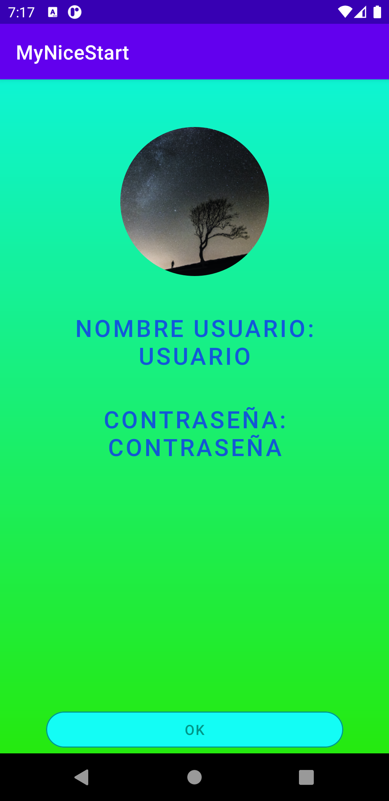

# MyNiceStart

**5 Ventanas de la aplicacion MyNiceStart**

* Splash
  * Tiene una animación girando usando el logo de la app.

* Login
  * Es la ventana en la que introduces tu usuario y contraseña.

* Signin
  * Ventana en la que te registras en el caso que no tuvieses una cuenta

* Main1
  * Ventana que tiene la foto de perfil con el nombre de usuario y la
   contraseña de la cuenta

* Main2
  * Ventana que te muestra un texto con MAIN2

Splash | Login | Signin
-------|-------|-------
 |  | 

Main1 | Main2
-------|-------
 | 