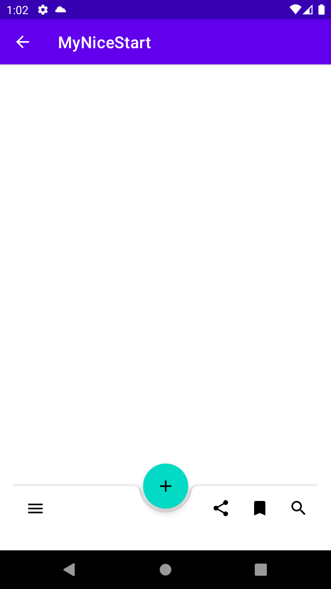

# MyNiceStart

**5 Ventanas de la aplicacion MyNiceStart**

* Splash
  * Tiene una animación girando usando el logo de la app.

* Login
  * Es la ventana en la que introduces tu usuario y contraseña.

* Signin
  * Ventana en la que te registras en el caso que no tuvieses una cuenta

* Main1
  * Ventana que tiene la foto de perfil con el nombre de usuario y la
   contraseña de la cuenta
  * Contiene un SwipeRefresh, un expandible card view,
  * al mantener pulsada la foto de perfil se muestran 2 opciones y al 
  * hacer click en el icono de android del menu se muestra un alert dialog.

* Main2
  * Ventana que contiene un bottom app bar

Splash | Login | Signin
-------|-------|-------
 |  | 

Menu Contextual | Menu AppBar | Menu Bottom AppBar | Alert Dialog
-------|-------|-------|-------
 |  | | 

Expandable Cardview | SwipeRefresh1 | SwipeRefresh2 | Prueba Instrumentacion Login
-------|-------|-------|-------
 |  |  | 
